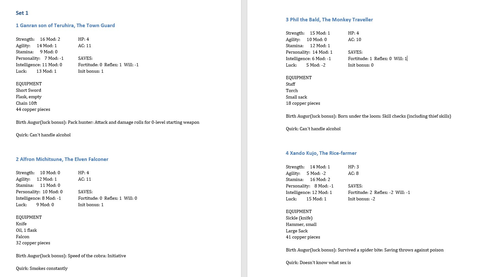

## About
Hello! I'm Philip Beeltje, a recent Chinese Studies graduate, who is currently trying to learn how to code.

Below are some of the projects I've been working on:

#### Python
[Character Generator](#Chargen)  
[Stock Price email alert](#Stockcheck)

#### JavaScript
[Timekeeper](#Timekeeper)

### Character Generator
<a name="Chargen"></a>
This Program generates characters for a boardgame. First the program asks how many Sets and characters per set you want. 

A character consists of a Name, an Occupation, a Quirk and some Stats (ie Strength, Agility). Names are generated from parts of names stored in arrays. The program then randomly picks an occupation with the appropriate trade-goods from a table in an excel file, along with a Quirk and a random piece of equipment. Stats are rolled randomly, one stat will be dependant on the occupation. 

This little function counts the number of rows that are filled in in the excell sheet. This makes it so you can keep adding new things to the sheet without having to change any code:
```python
def rowCounter(sheet):
    count = 0
    x = 1
    while True:
        cell = 'A'+ str(x)
        if sheet[cell].value is not None:
            count += 1
            x+=1
        else: break
    return count
```

All these characters and Sets are then put into a docx file. The filename of the docx is stamped with the time of generation so they don't get overwritten:
```markdown
dateTimeObj = datetime.now() #timestamp to make a unique document name
timestampStr = dateTimeObj.strftime("%d %b  %H.%M.%S")
docname = 'DCCgen ' + timestampStr +'.docx' 
document.save(docname)
```
*(example: DCCgen 17 May  19.47.30.docx)*

<a href="exampledoc.jpg" target="blank"></a>

At one time this project was pretty clean! it's become a bit more jumbled over time as I added more features.  
[Repository](https://github.com/Pbeeltje/DCCgen) 

### Stock Alert
<a name="Stockcheck"></a>
This short program takes stock information from the alpha vantage API and when the price passes a certain barrier it sends an email.
The stocks you want to track are manually inserted into the stock_list dictionary/3d array, along with an upper and lower price-limit which will trigger alerts.

The program checks the price every 300ms.

Code: (won't work as is, as you need to set up your own API code and e-mail)
```markdown
"""
Created on Tue Dec 15 14:24:01 2020

@author: p beeltje
"""

import pandas as pd #data manipulation and analysis package
from alpha_vantage.timeseries import TimeSeries #enables data pull from Alpha Vantage
#import matplotlib.pyplot as plt #if you want to plot your findings
import time
import smtplib #enables you to send emails
#from email.message import EmailMessage better email formatting 


stock_list = [['ACB','6','14','0'],
              ['CRWD','165','185','0'],
              ['PEIX','5','9','0'],
              ['XXL','18','25','0']] #insert stock alert array here [name,low,high,0] 0 is the per stock email counter starting point


max_emails = 5 # max emails before script stops sending emails

while True:
    
    for item in stock_list:
        stock = item[0] #takes stock code from array
        terror_price = int(item[1]) #takes low price from array
        target_sell_price = int(item[2]) #takes high price from array
        
        
        #Getting the data from alpha vantage
        ts = TimeSeries(key='Api Key', output_format='pandas') # dont forget your API key
        data, meta_data = ts.get_intraday(symbol=stock,interval='1min', outputsize='full')
        
        #We are currently interested in the latest price
        close_data = data['4. close'] #The close data column
        last_price = close_data[0] #Selecting the last price from the close_data column
        #Check if you're getting a correct value
        print(last_price) 
        
        
        #Set the desired message you want to see once the stock price is at a certain level
        sender_email = "sssss@gmail.com" #The sender email
        rec_email = "ssss@gmail.com" #The receiver email
        password = ("password") #The password to the sender email, need special APP Password for gmail
        
        item[3]=int(item[3]) #prepare email counter
        
        if last_price > target_sell_price and item[3] < max_emails:
            message = stock + " REJOICE!!! The stock has passed " + target_sell_price + " current price: " +  last_price  #The message you want to send
            server = smtplib.SMTP('smtp.gmail.com', 587)
            server.starttls()
            server.login(sender_email, password) #logs into your email account
            print("Login Success") #confirms that you have logged in succesfully
            server.sendmail(sender_email, rec_email, message) #send the email with your custom mesage
            print("Email was sent") #confirms that the email was sent 
            item[3]+=1
            print(item[3] + " emails sent for " + stock)
        elif last_price < terror_price and item[3] < max_emails:
            message = stock + " ALERT!!! The stock has dropped below " + terror_price + " current price: " +  last_price   #The message you want to send
            server = smtplib.SMTP('smtp.gmail.com', 587)
            server.starttls()
            server.login(sender_email, password) #logs into your email account
            print("Login Success") #confirms that you have logged in succesfully
            server.sendmail(sender_email, rec_email, message) #send the email with your custom mesage
            print("Email was sent") #confirms that the email was sent 
            item[3]+=1
            print(item[3] + " emails sent for " + stock)
            
        time.sleep(300)
```

### Timekeeper
<a name="Timekeeper"></a>
This project is basically a manual clock. I made it as a tool for a boardgame where 'game-time'is seperate from 'real-time'.
It comes in handy because sometime's a minute of game-time might be cause for 20 minutes of discussion in real time. The opposite also often occurs where hours or days pass in seconds.

Besides tracking time, whenever any period longer than 2 hours passes the program rolls two six-sides die to determine the weather.

<a href="timekeeper.html" target="blank">Try it out</a>

[Repository](https://github.com/Pbeeltje/timekeeper)


